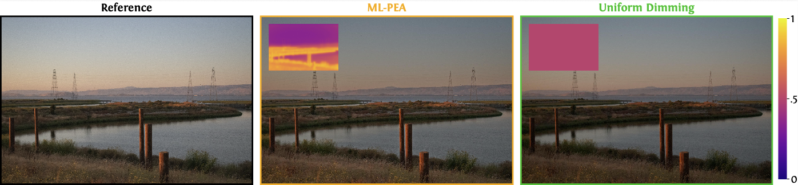

<h1>ML-PEA: Machine Learning-Based Perceptual Algorithms for Display Power Optimization</h1>

[**Kenneth Chen**](https://kenchen10.github.io/)1,
[**Nathan Matsuda**](https://www.nathanmatsuda.com)2,
[**Thomas Wan**](https://www.linkedin.com/in/thomas-cc-wan)2,
[**Ajit Ninan**](https://www.linkedin.com/in/ajitninan)2,
[**Alexandre Chapiro**](https://achapiro.github.io/)2
[**Qi Sun**](https://qisun.me/)1

1

&emsp;
2

  
  Our pipeline generates images which consume less power than the original when shown on a display, while minimizing perceptual impact. Here, we show an example of an image generated with our technique compared to the reference and its uniformly dimmed version. The corresponding dimming maps are shown in the insets, with the multiplicative scaling factor presented in the color bar on the right. Note that both the uniformly dimmed image and the image generated with our technique in this figure consume the same amount of display power: 52.1% of the reference.
  

## Abstract 
Image processing techniques can be used to modulate the pixel intensities of an image to reduce the power consumption of the display device. A simple example of this consists of uniformly dimming the entire image. Such algorithms should strive to minimize the impact on image quality while maximizing power savings. Techniques based on heuristics or human perception have been proposed, both for traditional flat panel displays and modern display modalities such as virtual and augmented reality (VR/AR). In this paper, we focus on developing and evaluating display power-saving techniques that use machine learning (ML). This pipeline was validated via quantitative analysis using metrics and through a subjective study. Our results show that participants prefer our technique over a uniform dimming baseline for high target power saving conditions. In the future, this work should serve as a template and baseline for future applications of deep learning for display power optimization.

## Quick Startup

To train a model, run the following command:

`python train.py --w_vgg 0.5 --w_ssim 5 --w_power 50 --method MULT --dataset div2k`

where `w_vgg`, `w_ssim`, and `w_power` are weights on the VGG, SSIM, and power losses, respectively. 
`--method MULT` sets the dimming map modulation to multiplicative, `I_new = I * dimming_map`.
Specify the training dataset (e.g. `div2k`).
Place dataset images in `div2k/train/*.png` and `div2k/test/*.png`.

## Checkpoints

Saved checkpoints are found at our [Google Drive link](https://drive.google.com/drive/folders/1Fpr_0HNpvti6gM-gYtaqBM0uRxJuEi-T?usp=share_link).